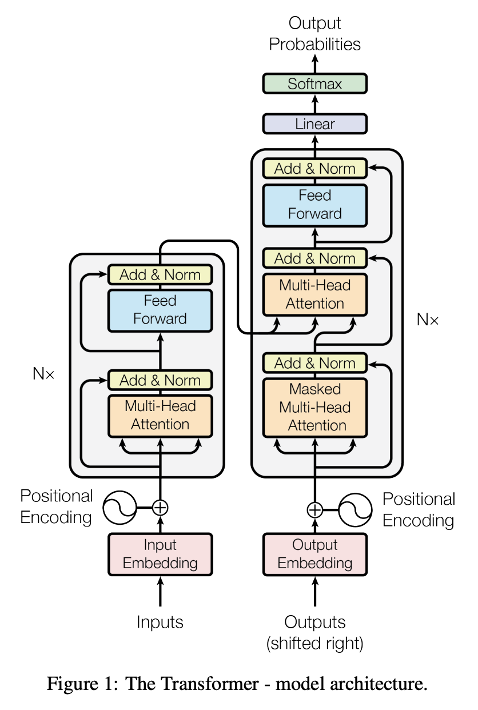

**1.基于RNN结构的序列模型缺点**

- 必须从前到后的计算，即计算`h_t`时必须已知`h_t-1`，导致很难并行

**2.基于CNN结构的序列模型缺点**

- 卷积神经网络对比较长的序列难以建模，受限于局部窗口操作，想提升感受野必须增加卷积层数

**3.transformer是基于注意力机制，没有循环操作与卷积操作**

**4.multi-head self-attention的由来**

- 卷积操作的一个优点是可以多通道输出，每个通道其实可以看作一种模式，为了模拟此效果，transformer引入了multi-head-attention概念

**5.序列模型都是基于encoder-decoder结构**

- 假设输入为`(x_1, ..., x_n)`, `xn`为第n个输入的向量表示；
- encoder的输出为`(z_1, ..., z_n)`,序列长度仍然为n，可理解为encoder将`x_n`映射为另外一种向量表示`z_n`，其中`z_n`结合了1～n个输入的所有信息；
- decoder会将`(z_1, ..., z_n)`映射到`(y_1, ..., y_m)`，这里输出序列长度可能与输入序列长度可能不同, n->m；
- decoder与encoder最大的不同是，解码器里的词是一个一个生成的，此过程被称为**auto-regressive**，比如说要得到`y_t`时，前面已经得到的`y_1`~`y_t-1`可作为当前的输入，这个过程就是自回归。

**6.transformer架构**

- self-attention、point-wise, fully-connection

**7.LayerNorm是什么？和batch norm的对比**

建议直接看视频对这部分的解释，在29min左右；

- batchnorm是在batch内在样本间（每一列）做归一化，均值为0，方差为1；layernorm是对每一个样本（每一行）做归一化；
- 为什么变长的应用里不使用batchnorm：

**8.为什么decoder中接收输入的multi-head self-attention是带mask的？**

- decoder相对于encoder来说，除了multi-head self-attention与FFP之外，还加了一个masked multi-head self-attention；
- 为什么带mask: 因为decoder做的是自回归任务，也就是说当前输出的input是上面一些时刻的输出，意味着当你做预测的时候你不能看到之后那些时刻的输出，但是在自注意力机制里，每一次都能看到整个完整的输入，为了避免这种情况发生，在decoder训练时，在预测第t个时刻的输出时，不应该看到t时刻以后的那些输入，所以引入了mask；

**9.attention中的q, k, v**

建议看视频理解，35min左右。

- key-value成pair对，query与key计算相似度获得权重，权重结合value得到新的value作为输出；
- query与key计算相似度时，为什么要除以序列长度`d_k`: 看视频，解释的很好，40min；
- mask如何加，在哪儿加：视频43min

**10.multi-head的意义**

- multi-head：一次attention操作是把q, k, v投影到低维，multi-head是指同样的attention操作做h次，将所有的attention输出concat起来，然后再投影回来得到最终输出；
- 为什么做multi-head：基于dot-product的attention中其实是没有可学习参数的，但是我们希望可以学习到不一样的模式，希望有一些不一样的计算相似度的方法；每一次attention计算都是一次投影的计算，我们记为w，我们希望w是可学的，新的度量空间可以匹配不同模式；multi-head做法就是给你h次机会，你将这h次的结果融合，可以学到不一样的投影方法，类似于CNN中的channle；
